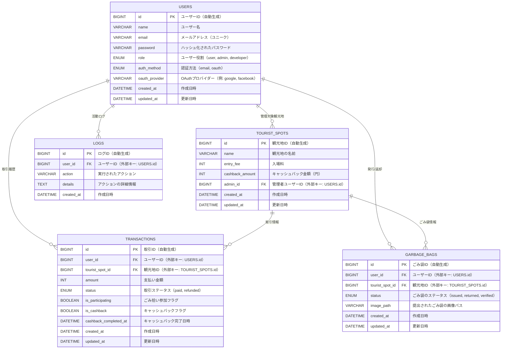

# ER_Diagram

```mermaid
erDiagram
    USERS {
        BIGINT id PK "ユーザーID（自動生成）"
        VARCHAR name "ユーザー名"
        VARCHAR email "メールアドレス（ユニーク）"
        VARCHAR password "ハッシュ化されたパスワード"
        ENUM role "ユーザー役割（user, admin, developer）"
        ENUM auth_method "認証方法（email, oauth）"
        VARCHAR oauth_provider "OAuthプロバイダー（例: google, facebook）"
        DATETIME created_at "作成日時"
        DATETIME updated_at "更新日時"
    }
    TOURIST_SPOTS {
        BIGINT id PK "観光地ID（自動生成）"
        VARCHAR name "観光地の名前"
        INT entry_fee "入場料"
        INT cashback_amount "キャッシュバック金額（円）"
        BIGINT admin_id FK "管理者ユーザーID（外部キー: USERS.id）"
        DATETIME created_at "作成日時"
        DATETIME updated_at "更新日時"
    }
    GARBAGE_BAGS {
        BIGINT id PK "ごみ袋ID（自動生成）"
        BIGINT user_id FK "ユーザーID（外部キー: USERS.id）"
        BIGINT tourist_spot_id FK "観光地ID（外部キー: TOURIST_SPOTS.id）"
        ENUM status "ごみ袋のステータス（issued, returned, verified）"
        VARCHAR image_path "提出されたごみ袋の画像パス"
        DATETIME created_at "作成日時"
        DATETIME updated_at "更新日時"
    }
    TRANSACTIONS {
        BIGINT id PK "取引ID（自動生成）"
        BIGINT user_id FK "ユーザーID（外部キー: USERS.id）"
        BIGINT tourist_spot_id FK "観光地ID（外部キー: TOURIST_SPOTS.id）"
        INT amount "支払い金額"
        ENUM status "取引ステータス（paid, refunded）"
        BOOLEAN is_participating "ごみ拾い参加フラグ"
        BOOLEAN is_cashback "キャッシュバックフラグ"
        DATETIME cashback_completed_at "キャッシュバック完了日時"
        DATETIME created_at "作成日時"
        DATETIME updated_at "更新日時"
    }
%% TODO: LOGSのアクションについて話し合う必要あり？開発の進み具合によっては放置でも良いかも
    LOGS {
        BIGINT id PK "ログID（自動生成）"
        BIGINT user_id FK "ユーザーID（外部キー: USERS.id）"
        VARCHAR action "実行されたアクション"
        TEXT details "アクションの詳細情報"
        DATETIME created_at "作成日時"
    }

    USERS ||--o{ TRANSACTIONS : "取引履歴"
    USERS ||--o{ GARBAGE_BAGS : "発行/返却"
    USERS ||--o{ TOURIST_SPOTS : "管理対象観光地"
    TOURIST_SPOTS ||--o{ GARBAGE_BAGS : "ごみ袋情報"
    TOURIST_SPOTS ||--o{ TRANSACTIONS : "取引情報"
    USERS ||--o{ LOGS : "活動ログ"
```
